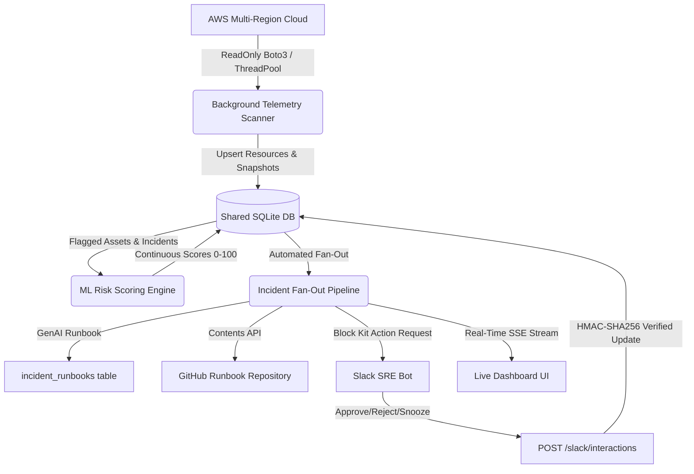

# Capstone Project: Status & Architecture Document (Shadow.Guard v3.0)

This document serves as the master architectural specification for **Shadow.Guard – Cloud Risk Scoring & Rogue Cloud Resource Detector** (Hugging Face Space / Docker deployment).

---

## 🏗️ Architecture & Component Overview

---

## ✅ Completed Milestones & Current State

### 1. Docker & Hugging Face Runtime (Task 1)
- **Status:** COMPLETED 🟢
- **Details:** Gradio UI and ZeroGPU completely removed. Container runs `uvicorn frontend.server:app --host 0.0.0.0 --port 7860`.
- **Auto-Seeding:** Database auto-initializes and seeds with diverse cloud resources on startup (`shared/db.py`) ensuring the dashboard is never blank.

### 2. Live Feed & Account-Wide Telemetry (Task 2 & Addendum A1)
- **Status:** COMPLETED 🟢
- **Details:**
  - Real-time Server-Sent Events stream: `GET /api/live-feed/stream` (with polling fallback `GET /api/live-feed`).
  - Account-wide metrics: Total assets, flagged, high-risk, monthly waste, pending reviews, multi-region scope selector.
  - Streaming line chart (events per minute, rolling 15m), Risk-tier donut (click-to-filter), Service breakdown bar chart (click-to-filter).
  - Chronological live feed stream with pause/resume, search, and click-to-view in Incidents.

### 3. Incidents & GenAI Incident Runbooks (Task 3 & Addendum A2, A4)
- **Status:** COMPLETED 🟢
- **Details:**
  - Full matrix of past and open incidents with status badges (`Open`, `Pending Approval`, `Approved`, `Rejected`, `Snoozed`, `Resolved`).
  - Expandable accordion per row displaying LLM-generated incident runbooks (summary, service/configuration root cause, impact, containment commands, verification steps, future guardrails, timeline).
  - Deterministic template fallback (`template-generated`) when LLM key is absent.
  - Pipeline status strip (`Detected -> Runbook -> GitHub -> Slack`) and GitHub runbook links.

### 4. Zero-Persistence In-Memory Log Analyzer (Task 4)
- **Status:** COMPLETED 🟢
- **Details:**
  - File picker & drag-and-drop supporting `.txt` and `.log` up to 5 MB with client-side validation.
  - `POST /api/log-analyzer`: in-memory parsing of timestamps, severity, error signatures, IPs, resource IDs, HTTP codes, AWS events.
  - Generates comprehensive markdown incident report.
  - Interactive charts (severity distribution, top error signatures, top source IPs/resources).
  - **Zero-Persistence Guarantee:** No file or data persistence to disk, database, Slack, GitHub, or any external service. Secrets redacted before LLM synthesis.

### 5. SRE Approvals & Governance Workflow (Task 5 & Addendum A3)
- **Status:** COMPLETED 🟢
- **Details:**
  - Web approve/reject buttons removed; approval/rejection actions are restricted to Slack.
  - Per-item workflow status dropdown (`Pending`, `In Review`, `Approved (via Slack)`, `Rejected (via Slack)`, `Snoozed`, `Escalated`).
  - Reminder scheduling (1h, 4h, 24h, custom datetime) with active badge and in-app toast notification.
  - Threaded investigation comments per approval request.
  - Human-readable timestamps (relative time with absolute local/UTC hover tooltips) and extended historical audit trail.

### 6. Elimination of Deprecated Elements (Task 6)
- **Status:** COMPLETED 🟢
- **Details:**
  - "Add Asset", "Simulate Alert", "Run Pipeline", "Pipeline Runner & Terminal", and "ML Scoring Sandbox" completely removed.
  - Deprecated execution endpoints (`/api/pipeline/run`, `/api/pipeline/simulate`) return 404.
  - `run_pipeline.py` preserved for CLI operations only.

### 7. Automated Live AWS Fan-Out & Slack Two-Way Sync (Addendum A0–A7)
- **Status:** COMPLETED 🟢
- **Details:**
  - Background worker periodically scans enabled regions using read-only boto3 calls.
  - Single idempotent function `handle_new_incident` manages deduplication, runbook generation, GitHub push, and Slack Block Kit alerts.
  - Public `/slack/interactions` endpoint with HMAC-SHA256 signature verification updates database, incident status, original Slack message, and live dashboard via SSE.
  - Comprehensive test suite in `tests/test_enhanced_features.py` (43 total tests passing).
