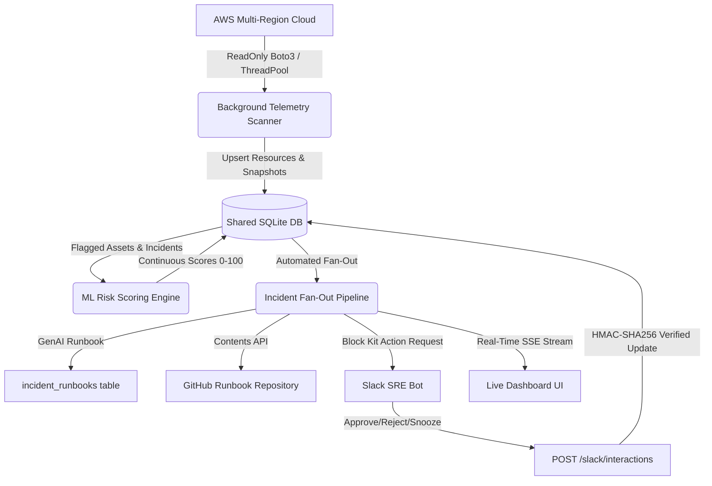

# Shadow.Guard — Cloud Risk Scoring & Rogue Asset Detector

Enterprise Cloud Governance, Live Multi-Region Telemetry, Automated Incident Runbooks, SRE Slack Sync, and In-Memory Log Analysis.

---

## 🏗️ Architecture


---

## 🚀 Navigation & Core Capabilities

The unified dashboard features 4 dedicated tabs in strict order:

1. **Live Feed**: Real-time Server-Sent Events (SSE) telemetry stream of cloud discoveries, ML scoring, SRE actions, and GitHub updates. Features rolling 15-minute event velocity chart, clickable risk-tier donut, service breakdown bar chart, and multi-region scope filtering.
2. **Incidents**: Complete historical log of all detected rogue assets and policy breaches. Each row expands into an LLM-generated Incident Runbook (or deterministic template fallback) with containment CLI commands, verification steps, and a pipeline status strip (`Detected -> Runbook -> GitHub -> Slack`).
3. **SRE Approvals**: Human-in-the-loop governance queue. Final approve/reject decisions are restricted to Slack. From the web console, operators manage workflow statuses (`Pending`, `In Review`, `Snoozed`, `Escalated`), schedule reminders with in-app toast alerts, and record threaded discussion notes.
4. **Log Analyzer**: In-memory security log parsing (`.txt` and `.log`, up to 5 MB) with strict zero-persistence guarantees. Extracts severities, IP addresses, resource IDs, error patterns, and AWS events; synthesizes an incident report; and provides client-side copy and download features.

---

## 💻 Running Locally

### 1. Local Python Environment
Ensure dependencies are installed:
```powershell
pip install -r requirements.txt
```

Launch the web server:
```powershell
python frontend/server.py
```
Open **[http://localhost:7860](http://localhost:7860)** in your browser.

### 2. Docker Container
Build and start the container:
```powershell
docker build -t shadow-guard .
docker run -p 7860:7860 shadow-guard
```
Open **[http://localhost:7860](http://localhost:7860)**.

---

## 🧪 Running Automated Tests
Run the comprehensive 43-test test suite covering all API endpoints, log parsing, fallback generation, deduplication, Slack signature verification, and read-only boto3 assertions:
```powershell
pytest
```

---

## 🛡️ Minimal Read-Only AWS IAM Policy

Shadow.Guard strictly reads cloud infrastructure and never executes mutate/write operations:
```json
{
  "Version": "2012-10-17",
  "Statement": [
    {
      "Sid": "ShadowGuardReadOnlyAccess",
      "Effect": "Allow",
      "Action": [
        "sts:GetCallerIdentity",
        "ec2:DescribeRegions",
        "ec2:DescribeInstances",
        "ec2:DescribeSecurityGroups",
        "s3:ListAllMyBuckets",
        "s3:ListBucket",
        "s3:GetBucketTagging",
        "s3:GetBucketPublicAccessBlock",
        "s3:GetBucketPolicyStatus",
        "rds:DescribeDBInstances",
        "rds:ListTagsForResource",
        "cloudwatch:GetMetricData",
        "cloudwatch:GetMetricStatistics",
        "ce:GetCostAndUsage",
        "tag:GetResources"
      ],
      "Resource": "*"
    }
  ]
}
```

---

## ⚙️ Environment Variables (.env)

See `.env.example` for full configuration:
- `PORT`: Web server port (default: 7860).
- `MOCK_MODE`: Set to `1` to run without AWS credentials (default: enabled when credentials absent).
- `AWS_REGION`, `AWS_ACCESS_KEY_ID`, `AWS_SECRET_ACCESS_KEY`: Standard AWS credentials.
- `SCAN_INTERVAL_SECONDS`: Background multi-region sweep interval (default: 300).
- `GITHUB_TOKEN`, `GITHUB_RUNBOOK_REPO`, `GITHUB_RUNBOOK_BRANCH`: GitHub Contents API credentials.
- `SLACK_BOT_TOKEN`, `SLACK_SIGNING_SECRET`, `SLACK_CHANNEL`: Slack app configuration.
- `LLM_API_KEY`, `LLM_BASE_URL`, `LLM_MODEL_NAME`: Optional LLM provider settings.

> **Note on Hugging Face Spaces**: If deploying to a Hugging Face Space, switch the Space Hardware from **ZeroGPU** to **CPU basic** in Space Settings, as Docker spaces do not require or support ZeroGPU.
