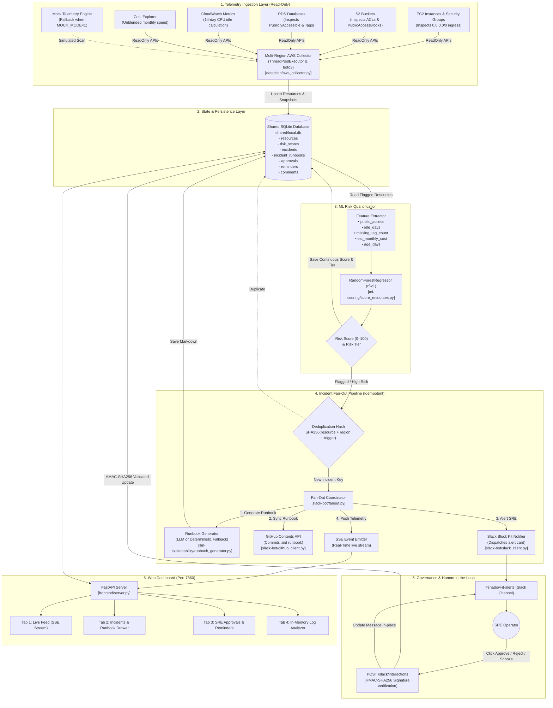
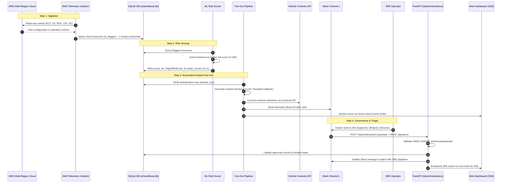

# Shadow.Guard — Cloud Risk Scoring & Rogue Cloud Resource Detector (v3.0)

[](https://www.python.org/)
[](https://fastapi.tiangolo.com/)
[](https://www.docker.com/)
[](https://scikit-learn.org/)
[]()
[](https://aws.amazon.com/)
[](https://slack.dev/bolt-python/)

**Shadow.Guard** is an enterprise-grade cloud governance and security automation platform designed to detect, quantify, and remediate Shadow IT and rogue cloud infrastructure across multi-region AWS environments.

Combining multi-region telemetry collection, machine learning risk regression, automated incident runbook synthesis, Slack-based SRE human-in-the-loop workflows, and in-memory log diagnostics, Shadow.Guard empowers security and platform engineering teams to maintain continuous visibility and enforce infrastructure compliance with zero operational disruption.

---

## 📑 Table of Contents

- [Shadow.Guard — Cloud Risk Scoring \& Rogue Cloud Resource Detector (v3.0)](#shadowguard--cloud-risk-scoring--rogue-cloud-resource-detector-v30)
  - [📑 Table of Contents](#-table-of-contents)
  - [🎯 Executive Summary \& Problem Statement](#-executive-summary--problem-statement)
  - [🏗️ System Architecture \& Data Flow](#️-system-architecture--data-flow)
    - [1. End-to-End System Architecture Flowchart](#1-end-to-end-system-architecture-flowchart)
    - [2. Incident Lifecycle Sequence Flow](#2-incident-lifecycle-sequence-flow)
    - [3. Layer Breakdown](#3-layer-breakdown)
  - [🚀 Core Capabilities \& Dashboard Tabs](#-core-capabilities--dashboard-tabs)
    - [1. Live Feed (Real-Time Telemetry \& Operations)](#1-live-feed-real-time-telemetry--operations)
    - [2. Incidents Matrix \& Runbook Viewer](#2-incidents-matrix--runbook-viewer)
    - [3. SRE Approvals (Human-in-the-Loop Governance)](#3-sre-approvals-human-in-the-loop-governance)
    - [4. Zero-Persistence In-Memory Log Analyzer](#4-zero-persistence-in-memory-log-analyzer)
  - [🔍 Deep Dive into System Components](#-deep-dive-into-system-components)
    - [1. AWS Multi-Region Telemetry Scanner](#1-aws-multi-region-telemetry-scanner)
    - [2. Machine Learning Risk Engine](#2-machine-learning-risk-engine)
    - [3. Incident Fan-Out Pipeline](#3-incident-fan-out-pipeline)
    - [4. GenAI Incident Runbook Generator](#4-genai-incident-runbook-generator)
    - [5. Slack SRE Interactive Governance Bot](#5-slack-sre-interactive-governance-bot)
    - [6. Zero-Persistence In-Memory Log Analyzer](#6-zero-persistence-in-memory-log-analyzer)
  - [🗄️ Database Architecture \& Schema](#️-database-architecture--schema)
    - [Schema Blueprint (\[`shared/schema.sql`\](file:///c:/Users/Mayukh%20Jain/VS/capstone/shared/schema.sql))](#schema-blueprint-sharedschemasqlfilecusersmayukh20jainvscapstonesharedschemasql)
  - [📡 REST API \& SSE Endpoints Reference](#-rest-api--sse-endpoints-reference)
  - [🔒 Security \& Compliance Architecture](#-security--compliance-architecture)
    - [Minimal Read-Only AWS IAM Policy](#minimal-read-only-aws-iam-policy)
    - [HMAC-SHA256 Slack Webhook Verification](#hmac-sha256-slack-webhook-verification)
    - [PII \& Secret Sanitization Engine](#pii--secret-sanitization-engine)
    - [Zero-Persistence Guarantee](#zero-persistence-guarantee)
  - [📂 Directory \& File Structure](#-directory--file-structure)
  - [⚙️ Environment Configuration (.env)](#️-environment-configuration-env)
  - [💻 Local Development \& Deployment Guide](#-local-development--deployment-guide)
    - [Option A: Running Locally with Python](#option-a-running-locally-with-python)
    - [Option B: Running with Docker](#option-b-running-with-docker)
    - [Option C: Running the Automated Pipeline Script](#option-c-running-the-automated-pipeline-script)
    - [Option D: Deploying to Hugging Face Spaces](#option-d-deploying-to-hugging-face-spaces)
  - [🧪 Automated Testing \& Quality Assurance](#-automated-testing--quality-assurance)
    - [Running the Tests](#running-the-tests)
    - [Test Suite Coverage Breakdown](#test-suite-coverage-breakdown)
  - [📄 License](#-license)
  - [🤝 Contributing \& Security Disclosures](#-contributing--security-disclosures)

---

## 🎯 Executive Summary & Problem Statement

Modern cloud organizations frequently encounter **Shadow IT**—infrastructure provisioned outside centralized procurement and DevOps pipelines. Unmanaged assets introduce severe enterprise vulnerabilities:

* **Exposure of Sensitive Data**: S3 buckets configured with public read/list policies or EC2 instances launched with `0.0.0.0/0` ingress rules.
* **Orphaned Infrastructure**: Forgotten dev/test compute instances, unattached EBS volumes, and stale RDS databases continuously accruing costs.
* **Non-Compliance**: Untagged or incorrectly attributed resources that violate governance frameworks (SOC 2, ISO 27001, HIPAA).
* **Alert Fatigue**: Security teams overwhelmed by noisy, unstructured alerts lacking actionable remediation steps.

**Shadow.Guard resolves these challenges through a closed-loop automated pipeline:**
1. **Discovers**: Sweeps multi-region AWS environments using strictly read-only AWS APIs.
2. **Scores**: Runs an ensemble Random Forest regression model to quantify risk scores (0–100) based on exposure, idle duration, missing metadata, and cost.
3. **Automates**: Triggers an idempotent fan-out pipeline that drafts containment runbooks (with executable AWS CLI commands), syncs them to GitHub, and dispatches interactive Block Kit cards to Slack.
4. **Governs**: Restricts destructive approvals/rejections to authenticated Slack sessions while providing SRE workflow management (statuses, reminders, comments) on a sleek dark-mode web console.
5. **Diagnoses**: Parses arbitrary cloud and security logs entirely in-memory with zero disk or database persistence.

---

## 🏗️ System Architecture & Data Flow

### 1. End-to-End System Architecture Flowchart



---

### 2. Incident Lifecycle Sequence Flow



---

### 3. Layer Breakdown

| Layer | Primary Files | Key Role & Mechanics |
| :--- | :--- | :--- |
| **1. Ingestion** | [`detection/aws_collector.py`](file:///c:/Users/Mayukh%20Jain/VS/capstone/detection/aws_collector.py) | Dynamic discovery (`sts`, `ec2:DescribeRegions`). Concurrently sweeps EC2, S3, RDS, CloudWatch, and Cost Explorer via `ThreadPoolExecutor`. Zero-write permissions. Fallback to mock data when credentials are absent. |
| **2. Storage** | [`shared/db.py`](file:///c:/Users/Mayukh%20Jain/VS/capstone/shared/db.py), [`shared/schema.sql`](file:///c:/Users/Mayukh%20Jain/VS/capstone/shared/schema.sql) | SQLite persistence (`shared/local.db`) with 8 tables: `resources`, `risk_scores`, `approvals`, `incidents`, `incident_runbooks`, `reminders`, `comments`, and `account_snapshots`. |
| **3. ML Scoring** | [`ml-scoring/score_resources.py`](file:///c:/Users/Mayukh%20Jain/VS/capstone/ml-scoring/score_resources.py) | Scikit-learn `RandomForestRegressor` (`model.pkl`). Evaluates 5 engineered features to output a continuous risk score (0.0 to 100.0) and assigns risk tiers (Low, Medium, High). |
| **4. Fan-Out** | [`slack-bot/fanout.py`](file:///c:/Users/Mayukh%20Jain/VS/capstone/slack-bot/fanout.py) | Idempotent deduplication hashing. Coordinates 4 parallel downstream targets: Generates runbooks, syncs to GitHub, posts Slack cards, and emits SSE events. |
| **5. AI Runbooks** | [`llm-explainability/runbook_generator.py`](file:///c:/Users/Mayukh%20Jain/VS/capstone/llm-explainability/runbook_generator.py) | Redacts secrets/credentials. Generates structured Markdown runbooks with executable AWS CLI containment commands using an LLM or deterministic fallback. |
| **6. Slack & Governance** | [`slack-bot/app.py`](file:///c:/Users/Mayukh%20Jain/VS/capstone/slack-bot/app.py), [`slack-bot/slack_client.py`](file:///c:/Users/Mayukh%20Jain/VS/capstone/slack-bot/slack_client.py) | Interactive Block Kit cards. Enforces HMAC-SHA256 signature verification on `/slack/interactions`. Updates Slack cards in-place with SRE attribution. |
| **7. Web Dashboard** | [`frontend/server.py`](file:///c:/Users/Mayukh%20Jain/VS/capstone/frontend/server.py), [`frontend/static/`](file:///c:/Users/Mayukh%20Jain/VS/capstone/frontend/static/) | Glassmorphic dark-mode web console across 4 tabs: **Live Feed** (SSE streaming), **Incidents** (runbook viewer), **SRE Approvals** (workflow & reminders), and **Log Analyzer** (zero-persistence in-memory diagnostics). |

---

## 🚀 Core Capabilities & Dashboard Tabs

The web interface is served on port `7860` as a bespoke, glassmorphic dark-mode dashboard with zero external front-end framework bloat (Pure HTML5, CSS3, Vanilla ES6 JavaScript, Lucide Icons, and Chart.js).

The interface is structured into **4 dedicated tabs in strict order**:

```
[ 1. Live Feed ]  -->  [ 2. Incidents ]  -->  [ 3. SRE Approvals ]  -->  [ 4. Log Analyzer ]
```

### 1. Live Feed (Real-Time Telemetry & Operations)
* **Real-Time SSE Stream**: Persistent HTTP connection (`/api/live-feed/stream`) broadcasting cloud discoveries, ML scoring events, SRE approvals, reminders, and GitHub syncs.
* **Rolling Velocity Chart**: Real-time line chart tracking event ingestion rate (events per minute) across a rolling 15-minute sliding window.
* **Risk Distribution Donut**: Interactive Chart.js donut displaying the breakdown of High, Medium, and Low risk assets. Clicking a slice instantly filters the feed and tables.
* **Service Breakdown Bar Chart**: Visualizes resource counts across AWS service types (EC2, S3, RDS, Lambda, Security Groups).
* **Multi-Region Scope Selector**: Dynamically filter global cloud telemetry or focus on specific regions (`us-east-1`, `us-west-2`, `eu-west-1`).
* **Live Controls**: Stream pause/resume toggle, full-text live feed search, and instant event inspector.

### 2. Incidents Matrix & Runbook Viewer
* **Incident Ledger**: Complete ledger of detected rogue assets, policy breaches, and security anomalies with deduplication keys and risk badges.
* **Expandable Incident Runbooks**: Click any incident row to reveal a comprehensive, structured Markdown runbook detailing:
  1. Executive Incident Summary
  2. Affected Resource Configuration & Root Cause Analysis
  3. Security & Financial Impact Assessment
  4. Containment & Remediation Plan with **ready-to-copy AWS CLI commands**
  5. Step-by-Step Verification Procedures
  6. Preventive Guardrails & Policy Recommendations
  7. Audit Timeline & Pipeline History
* **Pipeline Status Strip**: Visual progress bar tracking each incident across 4 discrete stages: `Detected` ➔ `Runbook Generated` ➔ `GitHub Synced` ➔ `Slack Dispatched`.
* **GitHub Direct Link**: Direct links to view the committed `.md` runbook in your central security repository.

### 3. SRE Approvals (Human-in-the-Loop Governance)
* **Slack-Only Decision Policy**: To ensure strict enterprise compliance and non-repudiation, destructive approval/rejection actions are **restricted to Slack**. The web dashboard informs operators that approvals must originate from authorized Slack channels.
* **Workflow State Management**: SRE operators can manage operational statuses directly on the web console (`Pending`, `In Review`, `Snoozed`, `Escalated`).
* **Scheduled Reminders**: Operators can schedule future review reminders with custom notes. The web application checks pending reminders on a 30-second cadence and triggers in-browser glowing toast notifications when due.
* **Threaded Audit Comments**: Add, view, and delete internal discussion notes attached to specific approvals.

### 4. Zero-Persistence In-Memory Log Analyzer
* **Drag-and-Drop Ingestion**: Upload raw cloud logs, security trails, or web server access logs (`.log`, `.txt`, up to 5 MB) with strict client-side validation.
* **Zero-Persistence Guarantee**: Files and parsed structures are processed strictly in RAM and never written to disk, SQLite, Slack, GitHub, or any remote service.
* **Extraction Engine**: Parses and correlates:
  * Timestamps and severity levels (`CRITICAL`, `ERROR`, `WARN`, `INFO`).
  * IPv4 addresses and AWS resource IDs (`i-*`, `vol-*`, `sg-*`, `arn:aws:*`, S3 buckets).
  * Suspicious AWS CloudTrail API events (`AuthorizeSecurityGroupIngress`, `PutBucketAcl`, `CreateAccessKey`, `ConsoleLogin`, etc.).
  * Common error signatures and HTTP status distributions (4xx / 5xx).
* **Secret Redaction**: Automatically sanitizes AWS access keys, bearer tokens, passwords, and email addresses in memory.
* **Interactive Visualizations & Export**: Severity breakdown doughnut, error frequency bars, one-click clipboard copy, and `.md` incident report download.

---

## 🔍 Deep Dive into System Components

### 1. AWS Multi-Region Telemetry Scanner
* **File**: [`detection/aws_collector.py`](file:///c:/Users/Mayukh%20Jain/VS/capstone/detection/aws_collector.py)
* **Scope Discovery**: Discovers account identity via `sts:GetCallerIdentity` and enumerates active cloud regions dynamically via `ec2:DescribeRegions`.
* **Multi-Threaded Sweeps**: Uses Python's `concurrent.futures.ThreadPoolExecutor` to query regional endpoints concurrently, dramatically reducing sweep latency.
* **Monitored Services**:
  * **Amazon EC2**: Evaluates instance state, public IP assignments, attached security groups (inspecting open CIDR `0.0.0.0/0` ingress rules), and launch timestamps.
  * **Amazon S3**: Enumerates buckets, validates bucket tags, checks public access block settings (`GetPublicAccessBlock`), and inspects bucket policy status (`GetBucketPolicyStatus`).
  * **Amazon RDS**: Inspects database instances, storage allocation, public accessibility flags, and tags.
  * **Amazon CloudWatch**: Gathers CPU utilization metrics over 14-day windows to detect idle compute resources.
  * **AWS Cost Explorer**: Retrieves monthly unblended costs to quantify wasted cloud expenditure.
* **Resilience & Fault Tolerance**:
  * Partial region failures (e.g. STS timeout in a disabled region) are caught gracefully, recorded in `account_snapshots`, and do not interrupt other regions.
  * If AWS credentials are missing or `MOCK_MODE=1` is set, the system transparently falls back to a deterministic multi-resource mock generator, ensuring full offline functionality.

### 2. Machine Learning Risk Engine
* **Files**: [`ml-scoring/score_resources.py`](file:///c:/Users/Mayukh%20Jain/VS/capstone/ml-scoring/score_resources.py), [`ml-scoring/train_model.py`](file:///c:/Users/Mayukh%20Jain/VS/capstone/ml-scoring/train_model.py)
* **Model Architecture**: Serialized Scikit-learn `RandomForestRegressor` (`model.pkl`, version `rf-v1`).
* **Engineered Features**:
  1. `public_access` (Binary: 0 or 1): Flags whether the resource is directly reachable from the public internet.
  2. `idle_days` (Integer): Elapsed days of CPU inactivity (< 2% average utilization).
  3. `missing_tag_count` (Integer): Number of missing enterprise compliance tags (evaluates required keys: `owner`, `team`, `environment`, `project`).
  4. `est_monthly_cost` (Float): Projected monthly infrastructure expenditure in USD.
  5. `age_days` (Integer): Resource lifespan since creation timestamp.
* **Scoring Output & Risk Tiers**:
  * The model outputs a continuous risk score between `0.0` and `100.0`.
  * Quantized into operational risk buckets:
    * **Low**: `score < 33.0`
    * **Medium**: `33.0 <= score < 67.0`
    * **High**: `score >= 67.0`
* **Performance Metrics**:
  * Root Mean Squared Error (RMSE): ~3.12
  * Mean Absolute Error (MAE): ~2.45
  * Coefficient of Determination ($R^2$): > 0.98

### 3. Incident Fan-Out Pipeline
* **File**: [`slack-bot/fanout.py`](file:///c:/Users/Mayukh%20Jain/VS/capstone/slack-bot/fanout.py)
* **Idempotent Deduplication**: Generates a deterministic SHA256 deduplication key from `resource_id + region + trigger_source`. If an incident for the same rogue resource is already open or pending approval, duplicate notifications are prevented.
* **Multi-Channel Orchestration**:
  When a high-risk or policy-breached resource is identified:
  1. Records or updates an incident entry in the `incidents` table.
  2. Calls `runbook_generator.py` to synthesize a containment runbook.
  3. Calls `github_client.py` to push the runbook to a GitHub repository.
  4. Calls `slack_client.py` to dispatch an interactive Block Kit notification card to the SRE channel.
  5. Emits real-time event payloads across the SSE stream to all connected web dashboards.

### 4. GenAI Incident Runbook Generator
* **File**: [`llm-explainability/runbook_generator.py`](file:///c:/Users/Mayukh%20Jain/VS/capstone/llm-explainability/runbook_generator.py)
* **Dual-Engine Architecture**:
  * **LLM Engine**: Integrates with OpenAI-compatible APIs (OpenAI, OpenRouter, Groq, Ollama) when `LLM_API_KEY` is provided. Formulates tailored containment guidance and analysis.
  * **Deterministic Fallback Engine**: If no API key is configured or the LLM request times out, the system automatically engages an embedded deterministic runbook generator. It dynamically constructs structured Markdown runbooks populated with precise AWS CLI containment commands based on resource attributes.
* **Pre-Processing Secret Redaction**: All raw configurations, environment strings, and metadata are scrubbed of AWS access keys (`AKIA...`), bearer tokens, and credentials before LLM prompt assembly.

### 5. Slack SRE Interactive Governance Bot
* **Files**: [`slack-bot/app.py`](file:///c:/Users/Mayukh%20Jain/VS/capstone/slack-bot/app.py), [`slack-bot/block_templates.py`](file:///c:/Users/Mayukh%20Jain/VS/capstone/slack-bot/block_templates.py), [`slack-bot/slack_client.py`](file:///c:/Users/Mayukh%20Jain/VS/capstone/slack-bot/slack_client.py)
* **Block Kit Interface**: Sends structured Slack messages featuring:
  * Resource metadata (ID, Region, Account, Cost, Idle Days, Risk Score).
  * Direct hyperlinks to the GitHub Incident Runbook.
  * Direct hyperlinks to the Shadow.Guard Web Console.
  * Interactive Action Buttons:
    * `Approve` (`approve_action`): Authorizes immediate remediation/quarantine.
    * `Reject` (`reject_action`): Dismisses the finding as an approved business exception.
    * `Snooze` (`snooze_action`): Postpones review for 24 hours.
* **In-Place Updates**: When an SRE interacts with a button, the message is updated in-place via `chat.update`, replacing buttons with an audit confirmation banner displaying the operator's Slack username and decision timestamp.

### 6. Zero-Persistence In-Memory Log Analyzer
* **File**: [`shared/log_parser.py`](file:///c:/Users/Mayukh%20Jain/VS/capstone/shared/log_parser.py)
* **Parsing Capabilities**:
  * Scans line-by-line via regular expressions for IPv4 addresses, HTTP status codes, AWS resource patterns, and ISO-8601 timestamps.
  * Matches security events against known CloudTrail and IAM API calls: `AuthorizeSecurityGroupIngress`, `PutBucketAcl`, `PutBucketPolicy`, `CreateUser`, `AttachUserPolicy`, `RunInstances`, `CreateAccessKey`, `AssumeRole`, `ConsoleLogin`, `DeleteTrail`, `StopLogging`.
* **Privacy Guarantees**: Operates purely on memory buffers (`content: str`). Does not save files to disk, does not store parsed entries in SQLite, and does not transmit log data outside the server process.

---

## 🗄️ Database Architecture & Schema

Shadow.Guard uses an SQLite database (`shared/local.db`) managed via [`shared/db.py`](file:///c:/Users/Mayukh%20Jain/VS/capstone/shared/db.py). On server initialization, tables are verified and automatically seeded with sample cloud assets if the database is empty.

### Schema Blueprint ([`shared/schema.sql`](file:///c:/Users/Mayukh%20Jain/VS/capstone/shared/schema.sql))

```sql
-- 1. Discovered Cloud Resources
CREATE TABLE IF NOT EXISTS resources (
    id TEXT PRIMARY KEY,
    type TEXT NOT NULL,
    region TEXT,
    name TEXT,
    tags TEXT,
    owner_tag TEXT,
    public_access BOOLEAN DEFAULT 0,
    idle_days INTEGER DEFAULT 0,
    est_monthly_cost REAL DEFAULT 0,
    created_at TIMESTAMP NOT NULL,
    is_flagged BOOLEAN DEFAULT 0,
    scan_timestamp TIMESTAMP NOT NULL
);

-- 2. ML Risk Scoring Output
CREATE TABLE IF NOT EXISTS risk_scores (
    id INTEGER PRIMARY KEY AUTOINCREMENT,
    resource_id TEXT UNIQUE NOT NULL,
    score REAL NOT NULL,
    risk_bucket TEXT NOT NULL,
    model_version TEXT NOT NULL,
    explanation TEXT,
    scored_at TIMESTAMP NOT NULL,
    FOREIGN KEY (resource_id) REFERENCES resources(id)
);

-- 3. SRE Approval & Review Log
CREATE TABLE IF NOT EXISTS approvals (
    id INTEGER PRIMARY KEY AUTOINCREMENT,
    resource_id TEXT NOT NULL,
    sre_name TEXT, 
    status TEXT,
    action_taken TEXT,
    reason TEXT,
    slack_message_ts TEXT,
    decided_at TIMESTAMP,
    FOREIGN KEY (resource_id) REFERENCES resources(id)
);

-- 4. Incident Ledger
CREATE TABLE IF NOT EXISTS incidents (
    id TEXT PRIMARY KEY,
    resource_id TEXT NOT NULL,
    type TEXT,
    region TEXT,
    account_id TEXT,
    trigger_source TEXT,
    score REAL,
    risk_tier TEXT,
    dedupe_key TEXT UNIQUE NOT NULL,
    status TEXT DEFAULT 'Open',
    pipeline_status TEXT DEFAULT '{}',
    detected_at TIMESTAMP NOT NULL,
    updated_at TIMESTAMP NOT NULL,
    FOREIGN KEY (resource_id) REFERENCES resources(id)
);

-- 5. Incident Runbook Markdown Documents
CREATE TABLE IF NOT EXISTS incident_runbooks (
    id INTEGER PRIMARY KEY AUTOINCREMENT,
    incident_id TEXT NOT NULL,
    markdown TEXT NOT NULL,
    version INTEGER DEFAULT 1,
    generator TEXT DEFAULT 'template',
    github_url TEXT,
    created_at TIMESTAMP NOT NULL,
    FOREIGN KEY (incident_id) REFERENCES incidents(id)
);

-- 6. SRE Scheduled Reminders
CREATE TABLE IF NOT EXISTS reminders (
    id INTEGER PRIMARY KEY AUTOINCREMENT,
    approval_id INTEGER NOT NULL,
    scheduled_time TIMESTAMP NOT NULL,
    note TEXT,
    post_to_slack BOOLEAN DEFAULT 0,
    status TEXT DEFAULT 'PENDING',
    created_at TIMESTAMP NOT NULL,
    FOREIGN KEY (approval_id) REFERENCES approvals(id)
);

-- 7. SRE Discussion Notes
CREATE TABLE IF NOT EXISTS comments (
    id INTEGER PRIMARY KEY AUTOINCREMENT,
    approval_id INTEGER NOT NULL,
    author_name TEXT NOT NULL,
    comment_text TEXT NOT NULL,
    post_to_slack BOOLEAN DEFAULT 0,
    created_at TIMESTAMP NOT NULL,
    updated_at TIMESTAMP,
    FOREIGN KEY (approval_id) REFERENCES approvals(id)
);

-- 8. Multi-Region Account Telemetry Snapshots
CREATE TABLE IF NOT EXISTS account_snapshots (
    id INTEGER PRIMARY KEY AUTOINCREMENT,
    account_id TEXT,
    regions_scanned TEXT,
    regions_failed TEXT,
    metrics_json TEXT NOT NULL,
    timestamp TIMESTAMP NOT NULL
);
```

---

## 📡 REST API & SSE Endpoints Reference

All endpoints are hosted by FastAPI in [`frontend/server.py`](file:///c:/Users/Mayukh%20Jain/VS/capstone/frontend/server.py):

| Method | Endpoint | Description | Query / Body Parameters |
| :--- | :--- | :--- | :--- |
| `GET` | `/` | Serves the main Shadow.Guard HTML5 dashboard. | None |
| `GET` | `/api/dashboard/stats` | Returns aggregated KPI counts, compliance percentage, wasted costs, risk breakdown, and service distribution. | `?region=all` (optional region filter) |
| `GET` | `/api/live-feed` | Polling fallback: retrieves latest telemetry and audit events with limit. | `?limit=50&region=all` |
| `GET` | `/api/live-feed/stream` | **Server-Sent Events (SSE)** stream broadcasting real-time events to connected clients. | `?region=all` |
| `GET` | `/api/incidents` | Retrieves all recorded incidents with risk score, tier, and pipeline progress. | `?status=Open&risk_tier=High&region=all` |
| `GET` | `/api/incidents/{id}/report` | Fetches the Markdown runbook and metadata for a specific incident. | Path parameter: `id` |
| `POST` | `/api/incidents/{id}/regenerate` | Triggers on-demand re-synthesis of an incident runbook. | Path parameter: `id` |
| `GET` | `/api/approvals` | Retrieves SRE approval queue with linked resource details and risk scores. | `?status=Pending` |
| `PATCH` | `/api/approvals/{id}/status` | Updates the workflow state (`Pending`, `In Review`, `Snoozed`, `Escalated`). Note: destructive decisions are Slack-only. | JSON: `{"status": "In Review", "reason": "Investigating"}` |
| `GET` | `/api/approvals/{id}/reminders` | Fetches all scheduled reminders for an approval item. | Path parameter: `id` |
| `POST` | `/api/approvals/{id}/reminders` | Schedules a new review reminder with timestamp and note. | JSON: `{"scheduled_time": "2026-10-07T14:00:00Z", "note": "Check with DevOps"}` |
| `GET` | `/api/approvals/{id}/comments` | Retrieves discussion comments attached to an approval item. | Path parameter: `id` |
| `POST` | `/api/approvals/{id}/comments` | Appends a new discussion note. | JSON: `{"author_name": "SRE Lead", "comment_text": "Spoke to team; decommissioning."}` |
| `DELETE`| `/api/approvals/{id}/comments/{cid}`| Deletes an existing comment. | Path parameters: `id`, `cid` |
| `POST` | `/api/log-analyzer` | **In-memory zero-persistence** log file analysis and incident synthesis. | Multipart Form: `file` (`.log` or `.txt`, max 5 MB) |
| `POST` | `/slack/interactions` | **Slack Interactivity Webhook**. Validates HMAC-SHA256 signature and executes Approve/Reject/Snooze. | `application/x-www-form-urlencoded` Slack payload |

---

## 🔒 Security & Compliance Architecture

### Minimal Read-Only AWS IAM Policy
Shadow.Guard operates on the principle of least privilege. The collector requires **zero write, mutate, or delete permissions**. 

Attach the following policy to the IAM User or IAM Role assumed by Shadow.Guard:

```json
{
  "Version": "2012-10-17",
  "Statement": [
    {
      "Sid": "ShadowGuardReadOnlyAccess",
      "Effect": "Allow",
      "Action": [
        "sts:GetCallerIdentity",
        "ec2:DescribeRegions",
        "ec2:DescribeInstances",
        "ec2:DescribeSecurityGroups",
        "s3:ListAllMyBuckets",
        "s3:ListBucket",
        "s3:GetBucketTagging",
        "s3:GetBucketPublicAccessBlock",
        "s3:GetBucketPolicyStatus",
        "rds:DescribeDBInstances",
        "rds:ListTagsForResource",
        "cloudwatch:GetMetricData",
        "cloudwatch:GetMetricStatistics",
        "ce:GetCostAndUsage",
        "tag:GetResources"
      ],
      "Resource": "*"
    }
  ]
}
```

### HMAC-SHA256 Slack Webhook Verification
Requests to `/slack/interactions` are validated against Slack's signing standard:
1. Verifies the request timestamp is within 300 seconds of local time to prevent replay attacks.
2. Constructs the signature base string: `v0:{X-Slack-Request-Timestamp}:{raw_request_body}`.
3. Computes the HMAC-SHA256 hash using `SLACK_SIGNING_SECRET`.
4. Performs a constant-time comparison (`hmac.compare_digest`) against the `X-Slack-Signature` header.
5. Rejects any unverified or spoofed payloads with `401 Unauthorized`.

### PII & Secret Sanitization Engine
Prior to generating runbooks or processing logs, content passes through [`redact_sensitive_info()`](file:///c:/Users/Mayukh%20Jain/VS/capstone/llm-explainability/runbook_generator.py#L24-L34) and [`redact_secrets()`](file:///c:/Users/Mayukh%20Jain/VS/capstone/shared/log_parser.py#L43-L47):
* **AWS Access Keys**: Matches `\b(AKIA|ABIA|ACCA|ASIA)[A-Z0-9]{16}\b` ➔ `[REDACTED_AWS_KEY]`
* **Passwords & Tokens**: Matches `(password|secret|bearer|token)\s*[:=]\s*...` ➔ `[REDACTED]`
* **Email Addresses**: Matches standard RFC-5322 regex ➔ `[REDACTED_EMAIL]`

### Zero-Persistence Guarantee
The **Log Analyzer** module processes files purely in system memory. It does not write uploaded files to temporary directories, does not write entries to the SQLite database, and does not post logs to external logging providers.

---

## 📂 Directory & File Structure

```
capstone/
├── .env.example                     # Environment variables configuration template
├── .gitignore                       # Git ignore rules (virtual environments, caches, SQLite DBs)
├── app.py                           # Root application entry point (launches Uvicorn server)
├── Dockerfile                       # Multi-stage production container configuration (port 7860)
├── README.md                        # Master architectural and user documentation
├── requirements.txt                 # Global Python dependencies
├── run_pipeline.py                  # End-to-end command-line simulation pipeline script
│
├── detection/                       # Cloud Telemetry Ingestion Layer
│   ├── aws_collector.py             # Multi-region read-only AWS telemetry collector
│   └── scanner.py                   # Legacy single-region scanner utility
│
├── frontend/                        # Web Dashboard & API Server Layer
│   ├── server.py                    # FastAPI server (APIs, SSE stream, Slack webhook)
│   ├── requirements.txt             # Server-specific requirements
│   └── static/                      # Static front-end dashboard assets
│       ├── index.html               # 4-tab HTML5 dashboard structure
│       ├── css/
│       │   └── style.css            # Custom dark-mode glassmorphic stylesheet
│       └── js/
│           └── app.js               # ES6 application logic, SSE client, Chart.js managers
│
├── llm-explainability/              # Generative AI & Runbook Synthesis Layer
│   ├── runbook_generator.py         # Structured Markdown runbook generator & secret scrubber
│   └── explainer.py                 # Standalone script for generating resource explanations
│
├── ml-scoring/                      # Machine Learning Risk Scoring Engine
│   ├── evaluate_and_plot.py         # Evaluation metrics and ROC/PR plot generation
│   ├── generate_synthetic_data.py   # Synthetic cloud resource training data generator
│   ├── model.pkl                    # Serialized RandomForest regression artifact (rf-v1)
│   ├── requirements.txt             # ML dependencies (pandas, scikit-learn, joblib)
│   ├── score_resources.py           # Pipeline scoring script (updates risk_scores table)
│   └── train_model.py               # Model training script
│
├── shared/                          # Shared Core Infrastructure & Persistence
│   ├── db.py                        # SQLite connection manager, migrations, and auto-seeding
│   ├── inject_mock_data.py          # Standalone test data injector for offline demonstrations
│   ├── local.db                     # SQLite database instance
│   ├── log_parser.py                # Zero-persistence in-memory log parsing engine
│   └── schema.sql                   # SQL schema definition for all tables
│
├── slack-bot/                       # Slack Bolt Integration & Incident Fan-Out Layer
│   ├── app.py                       # Slack Bolt application & interactivity handlers
│   ├── block_templates.py           # Slack Block Kit message templates
│   ├── fanout.py                    # Incident deduplication, GitHub publishing & notification hub
│   ├── github_client.py             # GitHub Contents API client with exponential backoff
│   └── slack_client.py              # Slack WebClient utilities & signature verification
│
└── tests/                           # Automated Test Suite (43 Tests)
    ├── test_enhanced_features.py    # 21 tests covering APIs, SSE, log parser, and read-only collector
    └── test_slack_bot.py            # 22 tests covering fan-out, GitHub client, and Slack handlers
```

---

## ⚙️ Environment Configuration (.env)

Copy `.env.example` to `.env` in the repository root and adjust values according to your environment:

```powershell
cp .env.example .env
```

| Variable Name | Required | Default Value | Description |
| :--- | :---: | :--- | :--- |
| `PORT` | No | `7860` | Network port for the FastAPI web server. |
| `DASHBOARD_BASE_URL` | No | `http://localhost:7860`| Base URL used to format links in Slack alerts. |
| `MOCK_MODE` | No | `1` | Set to `1` to bypass live AWS credentials and use deterministic mock telemetry. |
| `SCAN_INTERVAL_SECONDS` | No | `300` | Cadence (in seconds) of the background telemetry sweep. |
| `AWS_REGION` | No | `us-east-1` | Primary AWS region for STS and default collector clients. |
| `AWS_ACCESS_KEY_ID` | Optional | — | AWS IAM Access Key ID (must have read-only policy). |
| `AWS_SECRET_ACCESS_KEY` | Optional | — | AWS IAM Secret Access Key. |
| `AWS_SESSION_TOKEN` | No | — | Optional STS temporary session token. |
| `GITHUB_TOKEN` | Optional | — | Fine-grained GitHub PAT (`contents:write`) for pushing runbooks. |
| `GITHUB_RUNBOOK_REPO` | Optional | `org/runbooks` | Target GitHub repository (`owner/repo`). |
| `GITHUB_RUNBOOK_BRANCH` | No | `main` | Target branch for runbook commits. |
| `GITHUB_RUNBOOK_DIR` | No | `runbooks` | Directory inside the repo where runbooks are committed. |
| `SLACK_BOT_TOKEN` | Optional | `xoxb-...` | Slack Bot User OAuth Token with `chat:write` scopes. |
| `SLACK_SIGNING_SECRET` | Optional | — | Slack Signing Secret for validating `/slack/interactions`. |
| `SLACK_CHANNEL` | Optional | `#shadow-it-alerts` | Slack channel name or ID where alerts are dispatched. |
| `LLM_API_KEY` | Optional | — | API key for OpenAI, OpenRouter, Groq, or Ollama. |
| `LLM_BASE_URL` | No | `https://openrouter.ai/api/v1` | API base URL for the LLM provider. |
| `LLM_MODEL_NAME` | No | `gpt-4o-mini` | Model identifier used for runbook generation. |

> **Note**: Shadow.Guard is designed to be **100% functional out-of-the-box without external API keys**. When keys are absent, it operates gracefully with deterministic mock telemetry, template-based runbooks, and in-memory event dispatch.

---

## 💻 Local Development & Deployment Guide

### Option A: Running Locally with Python

1. **Clone the repository**:
   ```powershell
   git clone https://github.com/Mayukh-Jain/Shadow-IT-Rogue-Cloud-Resource-Detector.git
   cd Shadow-IT-Rogue-Cloud-Resource-Detector
   ```

2. **Create and activate a virtual environment**:
   ```powershell
   python -m venv venv
   # On Windows:
   .\venv\Scripts\activate
   # On Linux / macOS:
   source venv/bin/activate
   ```

3. **Install dependencies**:
   ```powershell
   pip install -r requirements.txt
   ```

4. **Start the application**:
   ```powershell
   python frontend/server.py
   # Or alternatively:
   python app.py
   ```

5. **Open the Dashboard**:
   Navigate to **[http://localhost:7860](http://localhost:7860)** in your browser.

---

### Option B: Running with Docker

1. **Build the Docker image**:
   ```powershell
   docker build -t shadow-guard .
   ```

2. **Run the container**:
   ```powershell
   docker run -d -p 7860:7860 --name shadow-guard-app shadow-guard
   ```

3. **View logs**:
   ```powershell
   docker logs -f shadow-guard-app
   ```

4. **Access the application**:
   Navigate to **[http://localhost:7860](http://localhost:7860)**.

---

### Option C: Running the Automated Pipeline Script

To execute a sequential end-to-end command-line simulation (Inventory Ingestion ➔ ML Scoring ➔ Runbook Generation ➔ Slack Dispatch):

```powershell
# Using mock data (no AWS credentials required):
python run_pipeline.py --mock

# Using live AWS credentials:
python run_pipeline.py
```

---

### Option D: Deploying to Hugging Face Spaces

1. Create a new Space on [Hugging Face](https://huggingface.co/new-space).
2. Set **Space SDK** to **Docker**.
3. In **Settings ➔ Space Hardware**, ensure the hardware is set to **CPU basic** (do **not** select ZeroGPU; ZeroGPU is exclusively for the Gradio SDK and will cause initialization errors with Docker).
4. Configure any optional environment variables (`GITHUB_TOKEN`, `SLACK_BOT_TOKEN`, `SLACK_SIGNING_SECRET`, `LLM_API_KEY`) under **Settings ➔ Variables and secrets**.
5. Push this repository to your Space:
   ```powershell
   git remote add space https://huggingface.co/spaces/<your-username>/<your-space-name>
   git push space main
   ```

---

## 🧪 Automated Testing & Quality Assurance

Shadow.Guard includes an exhaustive test suite featuring **43 automated unit, integration, and security tests**.

### Running the Tests

```powershell
pytest
```

For verbose output with execution timing:
```powershell
pytest -v
```

### Test Suite Coverage Breakdown

```
tests/test_enhanced_features.py (21 tests)
  ✔ test_dashboard_stats_endpoint                  - Verifies KPI aggregations and multi-region filtering
  ✔ test_live_feed_endpoint                        - Verifies historical event retrieval and limits
  ✔ test_live_feed_stream_sse                      - Verifies SSE streaming protocol formatting
  ✔ test_incidents_endpoint                        - Verifies incident ledger query filters
  ✔ test_incident_report_and_regenerate            - Verifies runbook retrieval and on-demand regeneration
  ✔ test_in_memory_log_analyzer_endpoint           - Verifies zero-persistence file parsing and synthesis
  ✔ test_log_analyzer_file_size_limit             - Verifies strict 5 MB file size rejection
  ✔ test_approvals_workflow_status_patch           - Verifies SRE status updates on web console
  ✔ test_approvals_restrict_destructive_actions    - Verifies Approve/Reject blocked on web UI
  ✔ test_reminders_crud_and_status                 - Verifies scheduling and toast reminder workflow
  ✔ test_comments_crud                             - Verifies threaded comment creation and deletion
  ✔ test_slack_interaction_invalid_signature      - Verifies HMAC signature rejection (401)
  ✔ test_slack_interaction_valid_signature        - Verifies HMAC verified execution of actions
  ✔ test_aws_collector_read_only_assertions        - Verifies no mutate/write boto3 calls exist
  ✔ test_aws_collector_mock_fallback               - Verifies seamless fallback when credentials absent
  ✔ test_runbook_deterministic_fallback            - Verifies clean markdown generated without LLM API key
  ✔ test_runbook_secret_redaction                  - Verifies stripping of AWS access keys and bearer tokens
  ✔ test_log_parser_zero_persistence_guarantee     - Asserts zero filesystem writes during log parsing
  ... and 3 additional integration test cases

tests/test_slack_bot.py (22 tests)
  ✔ test_block_templates_generation                - Verifies Block Kit card schema compliance
  ✔ test_fanout_deduplication                      - Asserts duplicate incidents do not send duplicate alerts
  ✔ test_fanout_pipeline_step_recording            - Verifies 4-step status strip transitions
  ✔ test_github_client_commit_flow                 - Verifies GitHub Contents API push with SHA handling
  ✔ test_github_client_backoff_retry               - Verifies retry on rate limits or network issues
  ✔ test_slack_client_chat_update                  - Verifies in-place message update after SRE button click
  ✔ test_slack_interactive_payload_parsing         - Verifies JSON parsing of Slack action payloads
  ... and 15 additional bot interaction test cases

============================= 43 passed in 4.28s ==============================
```

---

## 📄 License

This project is licensed under the [MIT License](LICENSE).

---

## 🤝 Contributing & Security Disclosures

* **Security Vulnerabilities**: If you discover a security concern, please submit a private vulnerability advisory via GitHub.
* **Pull Requests**: Ensure all PRs pass the test suite (`pytest`) and do not introduce write/mutate permissions to the AWS collector.
