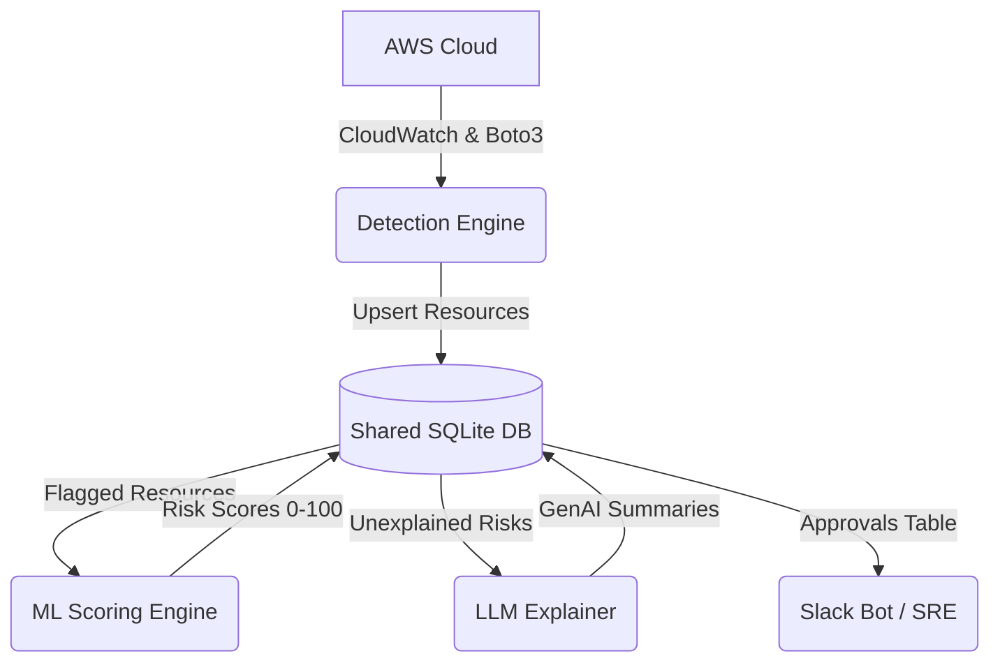

# Capstone Project: Shadow IT / Rogue Cloud Resource Detector

Welcome to the **Shadow IT Risk Scoring & Rogue Cloud Resource Detector** capstone project repository.

---

## 🏗️ Global Architecture


## 🛡️ Recent Security & Stability Updates
- **Detection Engine**: Upgraded from naive state-checking to True Idle Detection using CloudWatch CPU/Connection metrics.
- **ML Scoring**: Fixed target leakage by properly integrating resource age into the risk formula and balancing weight saturation strictly to 100.
- **Database Layer**: Enforced `PRAGMA foreign_keys = ON`, `UNIQUE` constraints on resource IDs, and robust `UPSERT` logic to prevent historical row duplication.
- **LLM Explainer**: Patched LangChain memory leaks (moving chain initialization out of loops) and added financial token limits (`max_tokens=100`) to prevent API bill runaway.
- **Timezone Math**: Bulletproofed datetime parsing across the pipeline by coercing all naive timestamps to UTC.

---

## 🚀 Quick Start

1. Open your terminal and navigate to the project directory:
   ```powershell
   cd "C:\Users\HP\Documents\capstone\ml-scoring"
   ```

2. Run the trained model in demo mode:
   ```powershell
   python predict.py --demo
   ```

3. Score a custom cloud resource:
   ```powershell
   python predict.py --public-access 1 --idle-days 45 --missing-tags 3 --monthly-cost 75.0 --age-days 120
   ```

4. Retrain the model anytime:
   ```powershell
   python train_model.py
   ```

---

## 📑 Project Files in `ml-scoring/`

* **[`generate_synthetic_data.py`](file:///C:/Users/HP/Documents/capstone/ml-scoring/generate_synthetic_data.py)**: Generates 1,500 synthetic cloud resource records with controlled noise.
* **[`data/synthetic_dataset.csv`](file:///C:/Users/HP/Documents/capstone/ml-scoring/data/synthetic_dataset.csv)**: Dataset used for model training and evaluation.
* **[`train_model.py`](file:///C:/Users/HP/Documents/capstone/ml-scoring/train_model.py)**: Trains the Random Forest Regressor and outputs metrics.
* **[`model.pkl`](file:///C:/Users/HP/Documents/capstone/ml-scoring/model.pkl)**: Serialized trained machine learning model.
* **[`evaluation_report.txt`](file:///C:/Users/HP/Documents/capstone/ml-scoring/evaluation_report.txt)**: Model evaluation metrics ($R^2 = 0.953$, $\text{MAE} = 3.898$).
* **[`predict.py`](file:///C:/Users/HP/Documents/capstone/ml-scoring/predict.py)**: Inference engine for predicting risk scores and tiers (`LOW`, `MEDIUM`, `HIGH`).
* **[`requirements.txt`](file:///C:/Users/HP/Documents/capstone/ml-scoring/requirements.txt)**: Python package dependencies.
* **[`README.md`](file:///C:/Users/HP/Documents/capstone/ml-scoring/README.md)**: Detailed ML module documentation.
