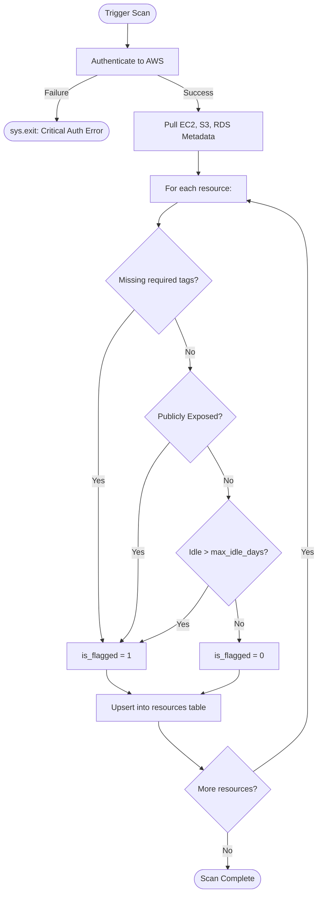

# Cloud Detection Engine: Design Doc & False Positive Handling

## 1. Architecture & Execution Flow
The Detection Engine runs on a scheduled cadence (e.g., via cron or EventBridge) to continuously inventory cloud resources. It follows a strict "Fail-Fast" architecture, halting execution immediately if AWS credentials are lost, rather than silently injecting errors into the shared database.

### Architecture Diagram
```mermaid
graph TD
    A[AWS Cloud] -->|boto3 API calls| B(scanner.py)
    A -->|CloudWatch Metrics| B
    B -->|Parse Tags & Properties| C{evaluate_policy()}
    C -->|Read Rules| D[policy.yaml]
    C -.->|If Violates Policy| E[is_flagged = 1]
    C -.->|If Compliant| F[is_flagged = 0]
    E --> G[(shared/local.db)]
    F --> G
```

### Detection Flowchart


## 2. Detection Logic
### Resource Pulling
We use `boto3` to actively query three core AWS services:
- **EC2**: Uses `describe_instances` to fetch instance state, public IP assignments, and tags.
- **S3**: Uses `list_buckets`, `get_bucket_tagging`, and `get_public_access_block` to determine exposure.
- **RDS**: Uses `describe_db_instances` and `list_tags_for_resource` to find idle databases and public accessibility flags.

### Compliance Evaluation
The `evaluate_policy` function acts as the gatekeeper. It parses the external `policy.yaml` and applies heuristic rules:
1. **Tag Completeness**: If any tag in `required_tags` (owner, team, environment, project) is missing, the resource is flagged.
2. **Public Access**: If the resource is publicly exposed and `allow_public_access` is false, it is flagged.
3. **Idle Time**: If the resource has been unused for longer than `max_idle_days` (default 14), it is flagged.

## 3. False Positive Handling
False positives occur when legitimate, actively used resources are flagged as "rogue". 

### Known Causes of False Positives
1. **Legacy Resources**: Older systems provisioned before strict Terraform IaC adoption may intentionally lack the new mandatory tags.
2. **Intentional Public Assets**: Public-facing websites hosted in S3 buckets will trigger the "Public Access" rule.
3. **Intermittent Batch Jobs**: EC2 instances that only spin up once a month might exceed the 14-day idle rule.

### Mitigation Strategies
- **Policy Decoupling**: The policy logic is externalized into `policy.yaml` so infrastructure teams can dynamically adjust thresholds (like increasing `max_idle_days`) without altering core Python logic.
- **Human-in-the-Loop Override**: The Detection Engine does **not** auto-remediate. It merely flags `is_flagged = 1`. The downstream Slack Bot guarantees that human SREs review the context and can click "Reject", effectively silencing the false positive safely.
