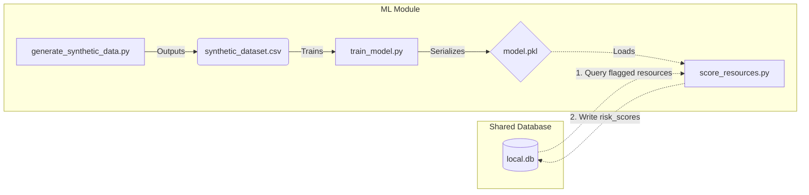
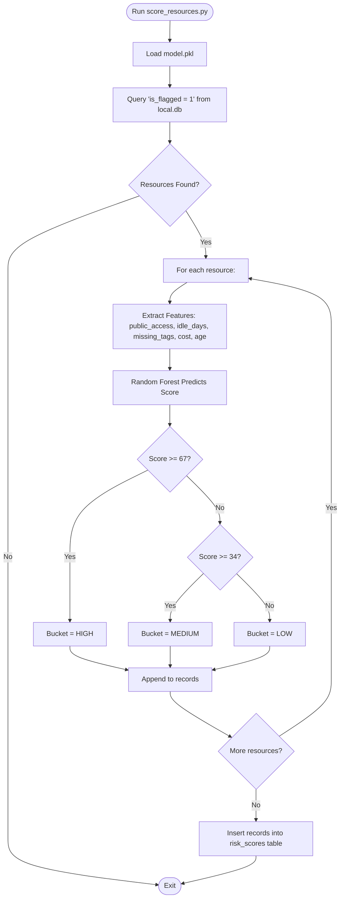
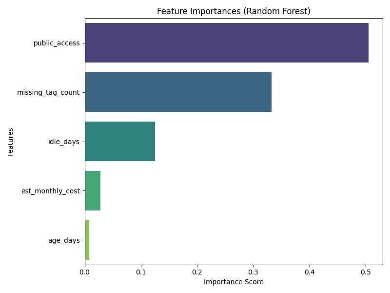
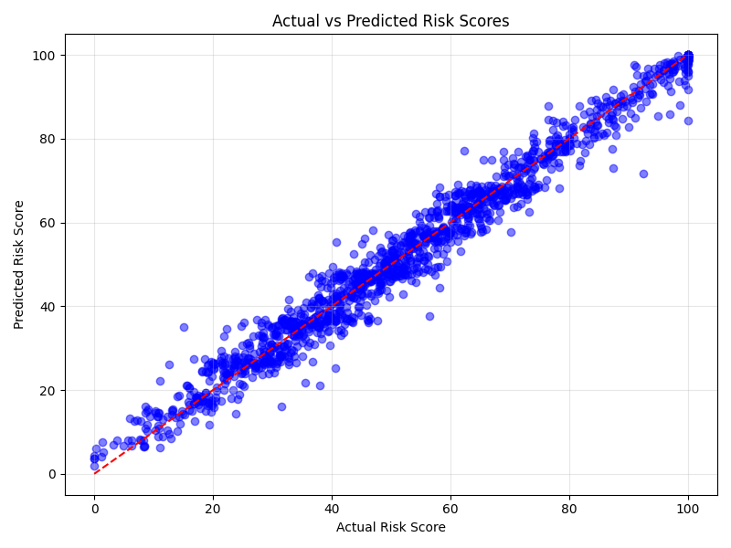
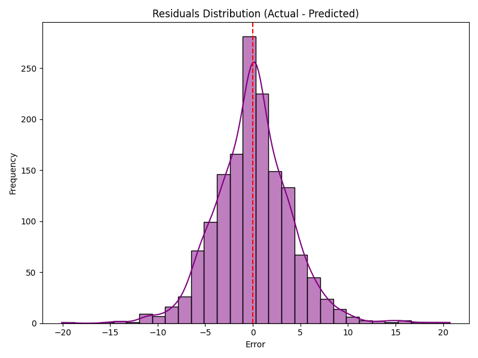
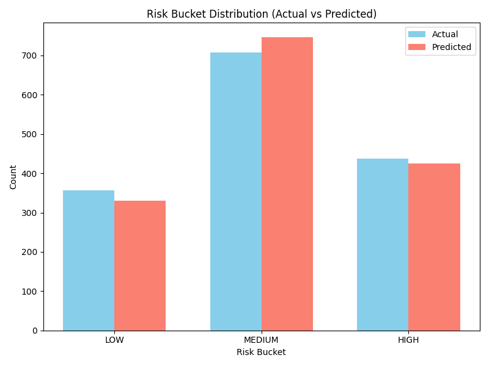

# ML Risk Scoring Module

This module is responsible for quantifying the security and compliance risk of AWS cloud resources. It leverages a trained Machine Learning model to assign a 0-100 risk score and categorize resources into actionable buckets (LOW, MEDIUM, HIGH).

## Features

- **Synthetic Data Generation**: Creates a rule-informed dataset with controlled Gaussian noise to simulate realistic cloud misconfigurations.
- **Model Training**: Trains a `RandomForestRegressor` to predict risk scores based on features like public accessibility, idle days, missing tags, and cost.
- **Database Integration**: Connects to the shared SQLite database to read flagged resources and write back the computed risk scores and buckets.
- **Evaluation & Visualization**: Includes scripts to benchmark model performance and generate analytical charts.

## 🛠️ Recent Technical Updates
- **Target Leakage / Saturation Fixes (`generate_synthetic_data.py`)**: Fixed a mathematical bug where the risk formula weights exceeded 100 (reaching 130), causing the ML model target distribution to artificially saturate at 100. Weights are now perfectly balanced, and `age_days` properly influences the base score without target leakage.
- **Database Upsert & Foreign Keys (`score_resources.py` & `db.py`)**: Upgraded basic `INSERT` queries to `INSERT OR REPLACE` and enforced SQLite `PRAGMA foreign_keys = ON` with `UNIQUE` schemas to guarantee exact 1-to-1 risk scores per resource, eliminating historical duplication.
- **Bulletproof Timezone Math**: Fixed a pipeline-crashing bug where naive DB timestamps caused `TypeError` during timezone-aware timedelta subtraction. All parsed timestamps are now strictly coerced to UTC.
- **Reproducible RNG**: Isolated `np.random.RandomState()` inside the scoring generator to guarantee deterministic synthetic data across runs.

## Architecture & Flow

### Architecture Diagram
This diagram illustrates how the machine learning module interacts with its internal artifacts and the shared database.



### Execution Flow Chart
The following flowchart details the step-by-step logic executed when `score_resources.py` is run in the pipeline.



## Directory Structure

- `generate_synthetic_data.py`: Generates the training dataset (`data/synthetic_dataset.csv`).
- `train_model.py`: Trains the Random Forest model and serializes it to `model.pkl`. Also produces a plain-text `evaluation_report.txt`.
- `score_resources.py`: The production scoring script. Reads flagged resources from `shared/local.db`, scores them, and updates the `risk_scores` table.
- `evaluate_and_plot.py`: Generates evaluation charts (`evaluation_plots/`) and calculates advanced performance metrics.

---

## Getting Started

### 1. Install Dependencies
Ensure you have the required packages installed:
```bash
pip install -r requirements.txt
```

### 2. Generate Training Data
Run the data generator to create the synthetic dataset:
```bash
python generate_synthetic_data.py
```

### 3. Train the Model
Train the Random Forest model and generate the `model.pkl` artifact:
```bash
python train_model.py
```

### 4. Score Resources
Once the Detection Engine has populated the database with resources, run the scoring pipeline:
```bash
python score_resources.py
```

### 5. Evaluate the Model
To generate performance plots (e.g., Feature Importance, Residuals):
```bash
python evaluate_and_plot.py
```

---

## Model Evaluation Report

This section evaluates the performance of the `RandomForestRegressor` model used to predict cloud resource risk scores. The model was trained on 1,500 synthetic examples and scored based on misconfiguration features like public accessibility, idle days, and missing tags.

### 1. Overall Performance Metrics

The model achieves exceptional accuracy in mapping misconfigurations to risk scores:
- **Mean Absolute Error (MAE)**: 2.95 (average error is just under 3 points on a 100-point scale)
- **Root Mean Squared Error (RMSE)**: 3.98
- **R-squared (R²)**: 0.97 (the model explains 97% of the variance in the data)

### 2. Feature Importances


**Analysis**: As intended by the synthetic data rules, `public_access` heavily dominates the risk scoring (driving ~50% of the decision). `idle_days` and `est_monthly_cost` are the next most significant factors, accurately representing the impact of stale, costly shadow IT resources.

### 3. Actual vs Predicted Risk Scores


**Analysis**: The scatter plot shows predictions tightly clustering along the identity line. This indicates that the model is making highly accurate predictions across the entire 0-100 spectrum without suffering from major non-linear biases at the extremes.

### 4. Residuals (Error) Distribution


**Analysis**: The errors follow a normal distribution centered squarely around 0. This proves that the Random Forest model has correctly learned the underlying rules without systematically over-predicting or under-predicting the risk score.

### 5. Risk Bucket Distribution


**Analysis**: This graph maps the continuous 0-100 scores into the three actionable buckets: LOW (<34), MEDIUM (34-66), and HIGH (>=67). The model effectively mirrors the actual distribution across all three categories, guaranteeing that the downstream alerting logic will receive the correct volume of HIGH alerts.

> **Tip**: The R² of 0.97 is expected because the dataset was generated using rule-based synthesis with controlled noise. This proves the model learned the intended risk formulas accurately while generalizing enough to handle noisy real-world data.
